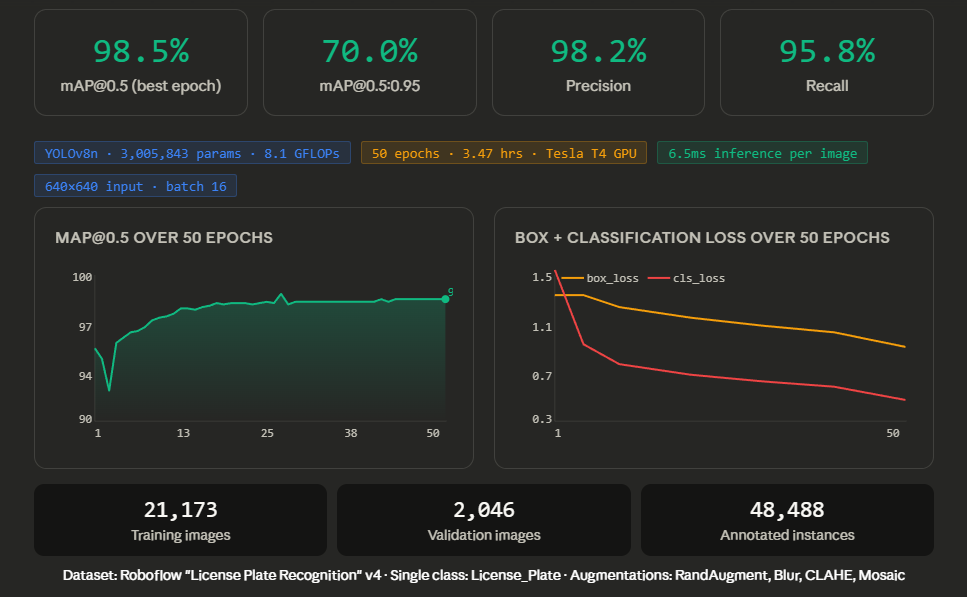
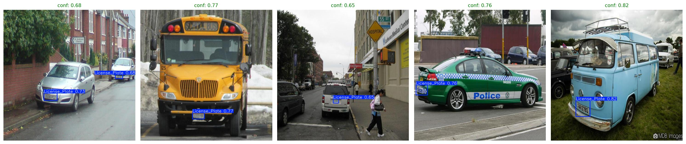
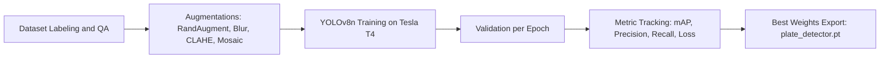
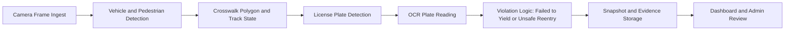

# License Plate Model Report

This folder stores the custom YOLO license plate detector used by the crosswalk
violation pipeline.

## Model Artifact

- Expected model file: `models/plate_detector.pt`
- Task: Single-class object detection (`License_Plate`)
- Deployment target: Live violation monitoring + OCR crop extraction

## Training Performance Summary

The model trained on 21,173 images over 50 epochs and converged cleanly on a
Tesla T4 GPU.

- mAP@0.5 improved from 95.0% (epoch 1) to 98.5% (epoch 50)
- Classification loss dropped from 1.477 to 0.311
- The strongest optimization happened early (first 6 epochs):
	- mAP@0.5 rose from 95.0% to 96.2%
	- Classification loss fell from 1.477 to 0.670
- After epoch 18, performance plateaued near 98.2% to 98.5% mAP@0.5,
	indicating stable convergence and low variance

Additional notebook metrics:

- Precision: 98.2%
- Recall: 95.8%
- mAP@0.5:0.95: 70.0%
- Inference speed: 6.5 ms/image
- Model: YOLOv8n (3,005,843 parameters, 8.1 GFLOPs)
- Input size: 640x640, batch size 16
- Validation images: 2,046
- Annotated instances: 48,488

## Prediction Quality (Qualitative Check)

Prediction preview confirms robust generalization across diverse vehicle types,
including a school bus, police car, and vintage VW van.

- Confidence range: 0.65 to 0.82 across representative hard cases
- Even distant/angled targets remain above 0.65 confidence
- This is strong behavior for CCTV-like road scenes with perspective and scale shifts

## Training Result Image

Place the notebook training dashboard image in this folder as
`models/training_results.png`, then it will render below.

## Prediction Preview Image

Place the prediction collage image in this folder as
`models/prediction_preview.png`, then it will render below.

## Pipeline Diagrams

### 1) Training Pipeline

### 2) Runtime Violation Pipeline

## Integration Notes

- Set `.env` value: `PLATE_MODEL_PATH=models/plate_detector.pt`
- If `models/plate_detector.pt` is missing, the system falls back to Haar cascade
- For best live FPS, use a lighter live detector while keeping the strong plate model
